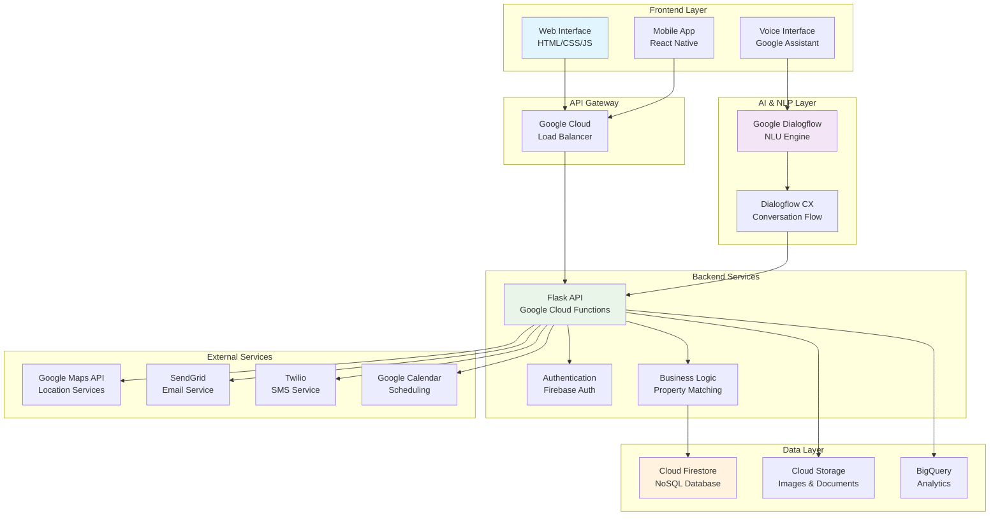
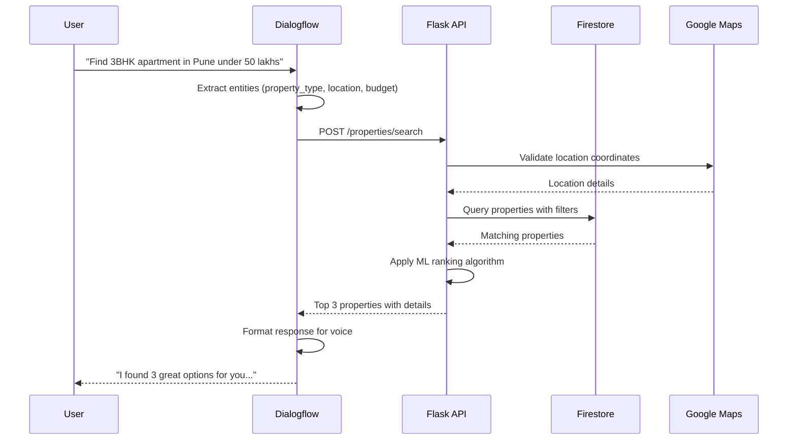
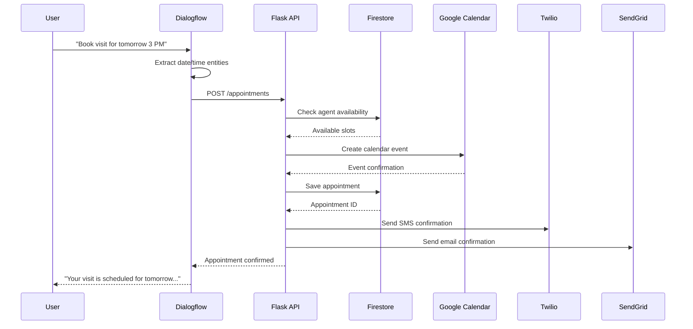
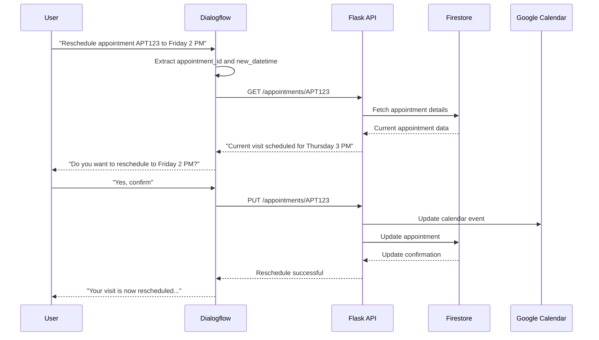

# ASHA - AI Real Estate Voice Assistant 🏡🤖

[](https://opensource.org/licenses/MIT)
[](https://www.python.org/downloads/)
[](https://cloud.google.com/)
[](https://cloud.google.com/dialogflow)

**ASHA (Automated Smart Home Advisor)** - Your Trusted Voice in Finding Your Dream Home

## 📋 Table of Contents

- [Overview](#overview)
- [Features](#features)
- [Technical Architecture](#technical-architecture)
- [Sequence Diagrams](#sequence-diagrams)
- [Tech Stack](#tech-stack)
- [Installation & Setup](#installation--setup)
- [API Documentation](#api-documentation)
- [Frontend Setup](#frontend-setup)
- [Dialogflow Configuration](#dialogflow-configuration)
- [Deployment](#deployment)
- [Contact](#contact)
- [Contributing](#contributing)
- [License](#license)

## 🎯 Overview

ASHA is India's first AI-powered real estate voice assistant that helps users find their dream homes through natural voice conversations. Built with Google Dialogflow for natural language processing, Flask for backend services, and a responsive web frontend.

### Key Capabilities:
- 🏠 **Property Search** - Find properties by type, location, budget, and preferences
- 📅 **Appointment Scheduling** - Book property visits with automated confirmations
- 🔄 **Appointment Management** - Reschedule visits with voice commands
- 📊 **Smart Recommendations** - AI-powered property matching
- 💬 **Natural Voice Interface** - Conversational property search experience
- 📱 **Multi-platform Support** - Web, mobile, and voice interfaces

## ✨ Features

### Core Features
- **Voice-First Interface**: Natural conversation flows powered by Dialogflow
- **Intelligent Property Matching**: Advanced filtering based on user preferences
- **Automated Appointment Booking**: Seamless scheduling with calendar integration
- **Real-time Availability**: Live property and appointment status updates
- **Feedback Collection**: Post-visit feedback and interest tracking
- **Multi-language Support**: Hindi and English language support

### Advanced Features
- **Predictive Recommendations**: ML-based property suggestions
- **Market Insights**: Real-time property market analysis
- **Virtual Property Tours**: 360° virtual walkthroughs
- **Document Management**: Secure document storage and sharing
- **CRM Integration**: Lead management and follow-up automation

## 🏗️ Technical Architecture



### Architecture Components

#### Frontend Layer
- **Web Interface**: Responsive HTML/CSS/JS application
- **Mobile App**: React Native cross-platform application
- **Voice Interface**: Google Assistant integration

#### AI & NLP Layer
- **Dialogflow**: Natural language understanding and conversation management
- **Intent Recognition**: Property search, appointment booking, and management intents
- **Entity Extraction**: Location, price, property type, and date/time entities

#### Backend Services
- **Flask API**: RESTful services hosted on Google Cloud Functions
- **Authentication**: Firebase Authentication for user management
- **Business Logic**: Property matching algorithms and appointment management

#### Data Layer
- **Cloud Firestore**: Real-time NoSQL database for properties and appointments
- **Cloud Storage**: Secure storage for property images and documents
- **BigQuery**: Analytics and reporting for business insights

## 🔄 Sequence Diagrams

### Property Search Flow



### Appointment Scheduling Flow



### Appointment Rescheduling Flow



## 🛠️ Tech Stack

### Backend
- **Language**: Python 3.9+
- **Framework**: Flask
- **Hosting**: Google Cloud Functions
- **Database**: Google Cloud Firestore
- **Storage**: Google Cloud Storage
- **Authentication**: Firebase Auth

### Frontend
- **Languages**: HTML5, CSS3, JavaScript (ES6+)
- **Styling**: Bootstrap 5, Custom CSS
- **Build Tools**: Webpack, Babel
- **Testing**: Jest, Cypress

### AI & Voice
- **NLP**: Google Dialogflow CX
- **Voice Recognition**: Google Cloud Speech-to-Text
- **Voice Synthesis**: Google Cloud Text-to-Speech
- **ML**: TensorFlow Lite for recommendations

### External APIs
- **Maps**: Google Maps API, Places API
- **Communications**: Twilio (SMS), SendGrid (Email)
- **Calendar**: Google Calendar API
- **Analytics**: Google Analytics, Mixpanel

## 🚀 Installation & Setup

### Prerequisites
- Python 3.9+
- Node.js 16+
- Google Cloud CLI
- Git

### Backend Setup

1. **Clone the repository**
   ```bash
   git clone https://github.com/yourusername/asha-real-estate-ai.git
   cd asha-real-estate-ai
   ```

2. **Create virtual environment**
   ```bash
   python -m venv venv
   source venv/bin/activate  # On Windows: venv\Scripts\activate
   ```

3. **Install dependencies**
   ```bash
   pip install -r requirements.txt
   ```

4. **Set up environment variables**
   ```bash
   cp .env.example .env
   # Edit .env with your API keys and configuration
   ```

5. **Initialize Google Cloud**
   ```bash
   gcloud init
   gcloud auth application-default login
   ```

6. **Deploy Cloud Functions**
   ```bash
   # Deploy main API
   gcloud functions deploy asha-api \
     --runtime python39 \
     --trigger-http \
     --entry-point asha_api \
     --allow-unauthenticated \
     --set-env-vars "$(cat .env | xargs)"

   # Deploy Dialogflow webhook
   gcloud functions deploy asha-webhook \
     --runtime python39 \
     --trigger-http \
     --entry-point asha_webhook \
     --allow-unauthenticated
   ```

### Frontend Setup

1. **Navigate to frontend directory**
   ```bash
   cd frontend
   ```

2. **Install dependencies**
   ```bash
   npm install
   ```

3. **Configure environment**
   ```bash
   cp .env.example .env.local
   # Add your API endpoints and keys
   ```

4. **Start development server**
   ```bash
   npm start
   ```

5. **Build for production**
   ```bash
   npm run build
   ```

## 📖 API Documentation

### Base URL
```
Production: https://api-asha-ai.cloudfunctions.net/asha-api
Development: http://localhost:8080
```

### Authentication
```javascript
// Include in request headers
{
  "Authorization": "Bearer YOUR_JWT_TOKEN",
  "Content-Type": "application/json"
}
```

### Core Endpoints

#### Property Search
```http
POST /properties/search
Content-Type: application/json

{
  "property_type": "apartment",
  "location": "Pune",
  "budget_range": {
    "min": 5000000,
    "max": 10000000
  },
  "specific_requirements": {
    "bedrooms": 3,
    "parking": true,
    "pet_friendly": false
  }
}
```

#### Schedule Appointment
```http
POST /appointments
Content-Type: application/json

{
  "property_id": "prop_001",
  "user_contact": {
    "name": "John Doe",
    "phone": "+91-9876543210",
    "email": "john@example.com"
  },
  "preferred_date": "2024-01-15",
  "preferred_time": "14:00"
}
```

### Error Handling
```json
{
  "code": "PROPERTY_NOT_FOUND",
  "message": "Property with ID prop_001 not found",
  "details": "Additional error context"
}
```

## 🎨 Frontend Setup

### Project Structure
```
frontend/
├── index.html
├── css/
│   ├── styles.css
│   ├── responsive.css
│   └── themes.css
├── js/
│   ├── app.js
│   ├── api.js
│   ├── voice.js
│   └── utils.js
├── images/
└── components/
    ├── property-card.js
    ├── appointment-form.js
    └── voice-interface.js
```

### Key Frontend Features

#### Voice Interface Integration
```javascript
// js/voice.js
class VoiceInterface {
  constructor() {
    this.recognition = new webkitSpeechRecognition();
    this.synthesis = window.speechSynthesis;
  }
  
  startListening() {
    this.recognition.start();
    this.recognition.onresult = (event) => {
      const transcript = event.results[0][0].transcript;
      this.sendToDialogflow(transcript);
    };
  }
  
  async sendToDialogflow(text) {
    // Send to Dialogflow API
    const response = await fetch('/webhook', {
      method: 'POST',
      body: JSON.stringify({ text }),
      headers: { 'Content-Type': 'application/json' }
    });
    
    const result = await response.json();
    this.speak(result.fulfillmentText);
  }
}
```

#### Property Search Interface
```javascript
// js/app.js
class PropertySearch {
  async searchProperties(criteria) {
    const response = await fetch('/api/properties/search', {
      method: 'POST',
      body: JSON.stringify(criteria),
      headers: { 'Content-Type': 'application/json' }
    });
    
    const properties = await response.json();
    this.displayProperties(properties);
  }
}
```

## 🗣️ Dialogflow Configuration

### Conversation Profile Settings
- **Display Name**: ASHA Real Estate Assistant
- **Environment**: English - en
- **Language**: English (Primary), Hindi (Secondary)
- **Call Companion**: Interactive mobile interface enabled

### Intent Configuration

#### Property Search Intent
```yaml
Training Phrases:
  - "I want to buy a house in Pune"
  - "Show me 3 BHK apartments under 50 lakhs"
  - "Find commercial spaces in Mumbai"

Parameters:
  - property_type: @sys.any
  - location: @sys.location
  - budget: @sys.number
  - bedrooms: @sys.number

Response:
  "I'll help you find the perfect property. Let me search for {property_type} in {location}..."
```

#### Appointment Booking Intent
```yaml
Training Phrases:
  - "Book a visit for tomorrow"
  - "Schedule appointment for property ABC123"
  - "I want to see this house on Friday"

Parameters:
  - property_id: @sys.any
  - date: @sys.date
  - time: @sys.time

Response:
  "I'll schedule your property visit for {date} at {time}. Please confirm your contact details."
```

### Webhook Configuration
```yaml
Webhook URL: https://your-region-your-project.cloudfunctions.net/asha-webhook
HTTP Method: POST
Headers:
  Content-Type: application/json
  Authorization: Bearer YOUR_TOKEN
```

### Fulfillment Examples
```json
{
  "fulfillmentText": "I found 3 amazing properties for you in Pune. The first is a beautiful 3BHK apartment in Baner priced at ₹85 lakhs with modern amenities.",
  "fulfillmentMessages": [
    {
      "text": {
        "text": ["I found 3 amazing properties for you..."]
      }
    }
  ]
}
```

## 🚀 Deployment

### Google Cloud Functions Deployment
```bash
# Deploy all functions
./scripts/deploy.sh

# Or deploy individually
gcloud functions deploy asha-api \
  --runtime python39 \
  --trigger-http \
  --memory 512MB \
  --timeout 60s \
  --set-env-vars ENVIRONMENT=production
```

### Frontend Deployment (Firebase Hosting)
```bash
# Build and deploy
npm run build
firebase deploy --only hosting
```

### Environment Variables
```bash
# .env file
GOOGLE_CLOUD_PROJECT=your-project-id
DIALOGFLOW_PROJECT_ID=your-dialogflow-project
FIREBASE_CONFIG=your-firebase-config
GOOGLE_MAPS_API_KEY=your-maps-key
SENDGRID_API_KEY=your-sendgrid-key
TWILIO_ACCOUNT_SID=your-twilio-sid
TWILIO_AUTH_TOKEN=your-twilio-token
```

## 📞 Contact

**ASHA Development Team**

- **Phone**: (323) 991-0225
- **Email**: support@asha-ai.com
- **Website**: https://asha-ai.com
- **GitHub**: https://github.com/yourusername/asha-real-estate-ai

### Support Channels
- 📧 **Technical Support**: tech-support@asha-ai.com
- 💼 **Business Inquiries**: business@asha-ai.com
- 🐛 **Bug Reports**: Create an issue on GitHub
- 💡 **Feature Requests**: discussions@asha-ai.com

## 🤝 Contributing

We welcome contributions to ASHA! Please see our [Contributing Guidelines](CONTRIBUTING.md) for details.

### Development Workflow
1. Fork the repository
2. Create a feature branch (`git checkout -b feature/amazing-feature`)
3. Commit your changes (`git commit -m 'Add amazing feature'`)
4. Push to the branch (`git push origin feature/amazing-feature`)
5. Open a Pull Request

### Code Standards
- Follow PEP 8 for Python code
- Use ESLint for JavaScript code
- Write unit tests for new features
- Update documentation for API changes

## 📄 License

This project is licensed under the MIT License - see the [LICENSE](LICENSE) file for details.

## 🙏 Acknowledgments

- Google Cloud Platform for hosting and AI services
- Dialogflow team for natural language processing
- Open source community for various libraries and tools
- Beta testers and early adopters for valuable feedback

---

**Built with ❤️ for the future of real estate in India**

*ASHA - Your Trusted Voice in Finding Your Dream Home* 🏡✨
